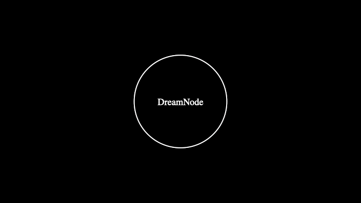
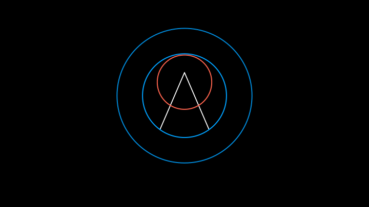
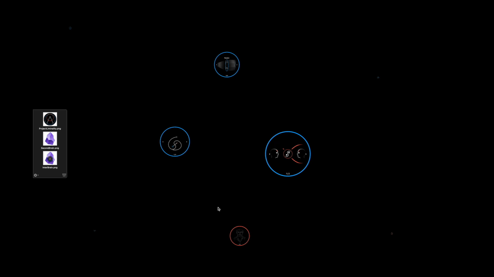
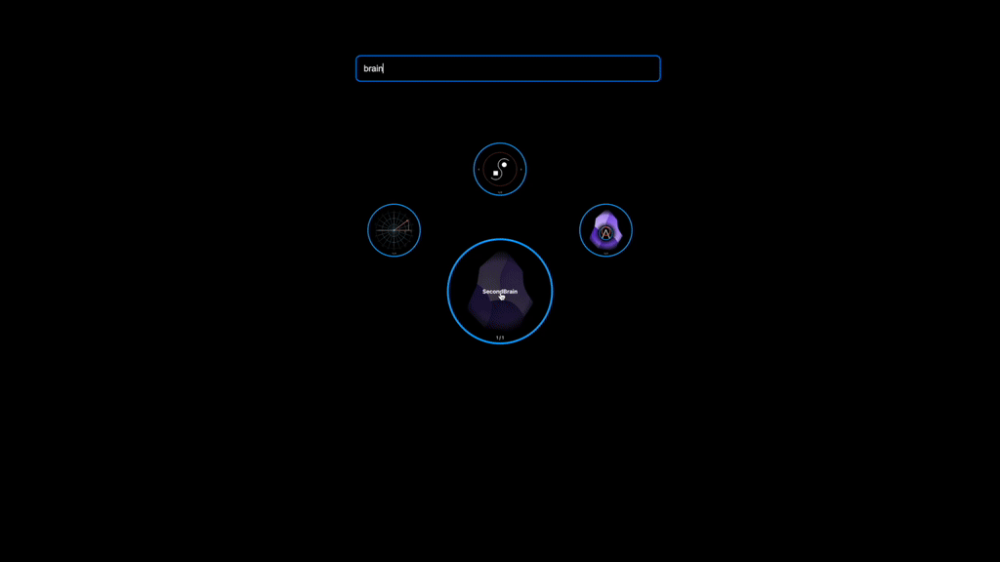
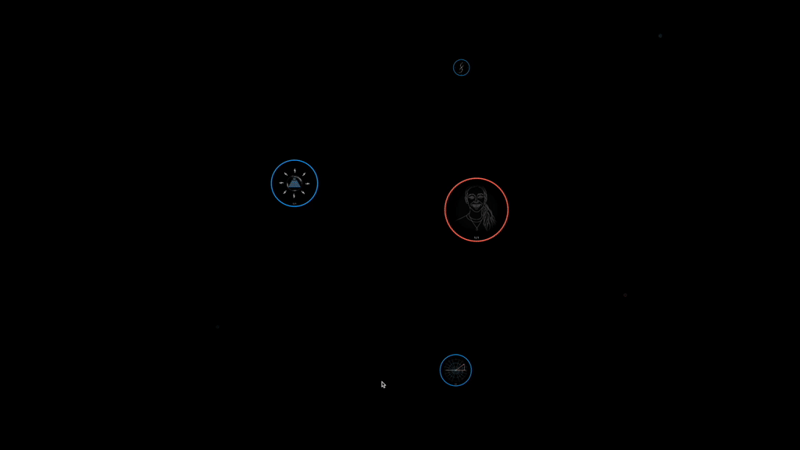
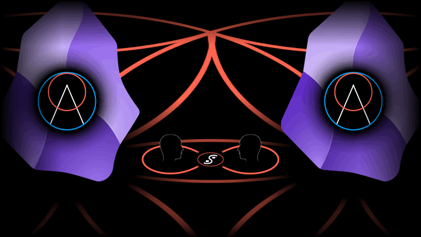
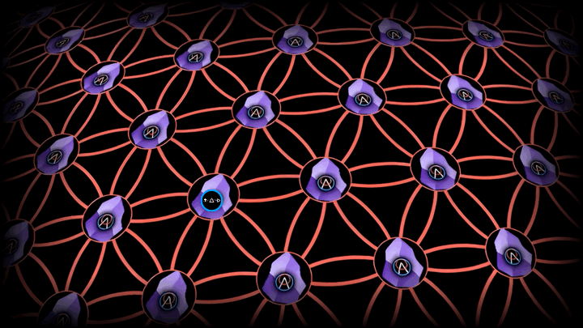
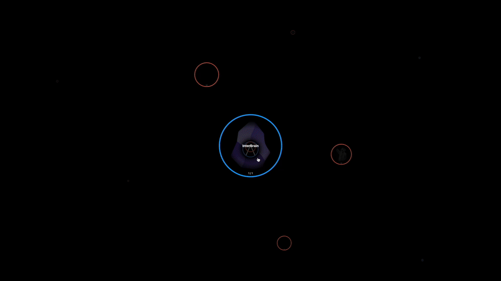
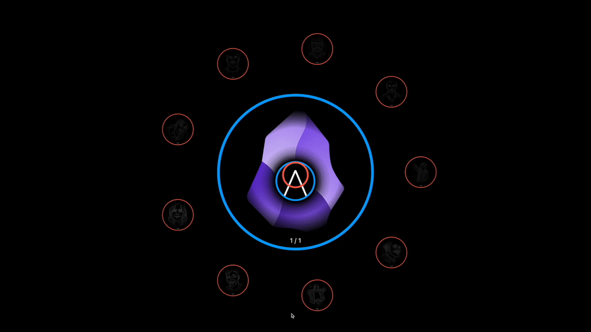

# The InterBrain: From Personal Knowledge Management to Collective Knowledge Gardening

## Introduction

The InterBrain is an innovative knowledge gardening system that aims to revolutionize the way we collectively relate to our ideas and stories. It transcends the traditional "Second Brain" paradigm, popularized by PKM tools like Obsidian, shifting to a dynamic, relational approach to organizing knowledge as opposed to static, top-down categorization.

## Project Status & Roadmap

> ⚡️ **Current Status: Epic 2 Complete**  
Epic 2 has been successfully implemented with a complete 3D spatial visualization system including React Three Fiber integration, dynamic view scaling, Fibonacci sphere layout, and Google Earth-style rotation controls. 84 unit tests passing with zero warnings.

> 🔬 **Previous Exploration:**  
Earlier exploration work including screenshots and recordings can be found at [**InterBrain-Prototype**](https://github.com/ProjectLiminality/InterBrain-Prototype). This repository contains the conceptual foundation and visual demonstrations that inform the current development approach.

> ✅ **Epic 1 Complete:**  
Foundation infrastructure with:
- Vite dual development workflow (browser + plugin)
- Command palette architecture (6 core commands)  
- Service layer abstraction (UI, Git, DreamNode, Vault)
- Zustand reactive state management
- Vitest testing framework (47 tests passing)

> ✅ **Epic 2 Complete:**  
3D Spatial Visualization System with:
- React Three Fiber integration in Obsidian workspace
- DreamNode 3D components with star rendering
- Google Earth-style sphere rotation controls
- Fibonacci sphere layout algorithm
- Dynamic view scaling (Apple Watch style)
- 84 unit tests with 100% coverage for new features

> 🚧 **Next: Epic 3 - DreamNode Management System**  
Building the core CRUD operations and Git integration for DreamNodes.

> 🌱 **Beyond the Plugin:**  
The InterBrain is designed as the foundation for **DreamOS** — a decentralized, AI-agent-powered operating system for collective sensemaking and human-computer symbiosis.

> 💡 **Development Roadmap:**
1. ✅ Electron Prototype ([InterBrain-Prototype](https://github.com/ProjectLiminality/InterBrain-Prototype))  
2. ✅ Epic 1: Plugin Infrastructure (this repository)  
3. 🚧 Epic 2: 3D Spatial Visualization System
4. 🔜 Epic 3: DreamNode Management System
5. 🪐 DreamOS system (future evolution)  

Current development progress is tracked through [**GitHub Issues**](https://github.com/ProjectLiminality/InterBrain/issues) and [**Project Board**](https://github.com/users/ProjectLiminality/projects/2).

## Core Concepts

### Dream Nodes

The fundamental unit of Project Liminality is the "Dream Node," which is implemented as a Git repository. Dream Nodes can embody two primary concepts:

1. **Dreams**: Abstract ideas, concepts, or any form of knowledge.
2. **Dreamers**: Representations of people or peers.



This dual nature allows for a flexible and interconnected knowledge structure.

### Dream Talk and Dream Song

Each Dream Node consists of two main components:

- **Dream Talk**: A concise, symbolic representation of the idea (like a thumbnail).
- **Dream Song**: A more elaborate explanation or exploration of the idea, containing multiple references to other Dream Talks.



### The InteBrain

Project Liminality structures knowledge based on social relationships and interactions, creating an "InteBrain." This approach allows users to organize information along the lines of their actual relational fields, transcending static, top-down categorization.
Thus uniting the multiplicity of Second Brains into a singular, interconnected InterBrain structure.


## Key Features

### 🌱 DreamNode Creation

Creating a new DreamNode is as easy as dragging and dropping a visual representation (DreamTalk) onto the interface. This will automatically create a new DreamNode with the same name as the file, containing the file.
Using the Command-N keyboard shortcut you can also create an empty DreamNode with your name of choice.



### 🕸️ Liminal Web

By linking the ideas you hold to the people you share them with, DreamNodes self-organize into your unique "Liminal Web."



This allows you to navigate your knowledge in an intuitive and organic fashion, transcending the need for contrived categorization or hierarchical management.


### 🔍 Semantic Search

Finding relevant DreamNodes is made easy and intuitive through semantic search - no need to worry about typos or remembering the exact name of any given idea!
Just enter a search query that is close enough in meaning to what you're looking for and it will magically be revealed.
(This existing feature is the basis for a yet-to-be-implemented realtime conversational copilot that always has the most relevant knowledge at hand for sharing during free-flowing conversation.)



### 🧬 DreamWeaving

Just like individual software modules can be combined into more sophisticated projects using git repositories, DreamNodes can be woven together into larger wholes. Using the Obsidian canvas, DreamTalk symbols can be woven together with text into DreamSongs. The resulting DreamSong can in turn again be distilled into a single DreamTalk symbol. This reciprocal and recursive many-to-one mapping between DreamSong and DreamTalk allows for the emergence of a vertical holarchy of DreamNodes. A universal pattern for performing the Hegelean Dialectic of ideas in the digital!


### 🔆 Coherence Beacon

Every time any Dreamer weaves together DreamNodes into larger wholes, the Coherence Beacon is triggered. This mechanism automatically identifies the subset of peers with whom they share any of the input DreamNodes and offers them the higher order DreamNode (including all input DreamNodes they may or may not already hold). By accepting the invitation they extend the signal to all of their peers and so on. This way only coherent ideas spread based on how much they resonate with the network, solving the virality problem. 
Freedom of speech bound by meritocratic reach!


### 🤖 Integrated AI Assistant

Since DreamNodes are based on git repositories, prominent AI pair-programming solutions like aider or cursor, being optimized for git, integrate seamlessly with the system. And just like the InteBrain generalizes git repos from computer code to all of knowledge, the same can be done out of the box with AI pair-programmers, using them as universal magical co-creators!
With ever more powerful, local, multi-modal models on the horizon and deeper integrations through frameworks like Model Context Protocol (MCP) truly the sky is the limit in terms of what can be achieved collectively through the InteBrain!


### 💬 Conversational Co-Pilot (TBD)

Through realtime transcription of free flowing conversations (video call or in-person) combined with the existing semantic search functionality, the system will constantly filter for the most relevant DreamNodes, making them readily available for reference and sharing during the dialogue - all without interrupting the flow! Say goodbye to awkward interruptions due to not finding a reference!
And the best part: referencing a DreamNode (implicitly or explicitly) automatically offers your peer to clone it. Which means sharing an idea and collaborating on it is the same thing in this system.



### 🎵 Songlines (TBD)

Everytime an idea is shared during a conversation, and thus the corresponding DreamNode is cloned, the relevant clip of the conversation is automatically added to the DreamNode as yet another way of expressing the idea. This way every DreamNode remembers the path it travels in a unique set of conversation clips - its Songline!
Not only do Songlines allow for an organic, decentralized and emergent replacement for static textbook definitions, they also constitute an invaluable source of community-generated and -owned data for representing knowledge in the most effortless yet high bandwidth way. In anticipation of local, multi-modal LLMs with effectively infinite context windows these Songlines may turn out to be a game changer in terms of leveraging collective knowledge and wisdom into actionable projects.



### 📱 Git Client Integration

Easily open any given DreamNode in your favorite git client of your choice.



### 📊 Organic Content Visualization

The content within a DreamNode is visually accessible on the backside using the beautiful circle packing algorithm of D3. Instantly access files and folders directly from the InteBrain.



### 📂 Finder Integration

Reveal DreamNodes in your file system with just one click.


## Real-World Applications & Project Synergy

The InteBrain system transforms how we share and organize knowledge, creating an organic ecosystem where ideas and initiatives can flourish together.

### 🎙️ Enhanced Podcasting
- **Real-time knowledge access**: Conversational copilots filter relevant dream nodes based on discussion topics
- **Enriched show notes**: Share actual knowledge units rather than just superficial references
- **Depth in knowledge transfer**: Audience receives not just references but entire repositories of contextual information

### 🔎 Collaborative Investigation
- **Emergent collective intelligence**: Investigators can effortlessly combine evidence and knowledge
- **Coherence Beacon in action**: Automatically invites collaborators who hold relevant knowledge
- **Scaling potential**: Enables millions of citizen journalists to work together on complex cases

### 🎓 Future of Education
- **Dissolving artificial boundaries**: Between disciplines and between education and life itself
- **Living classroom**: Every conversation becomes an educational opportunity
- **Emergent curriculum**: Knowledge expands organically based on contextual relevance
- **Symbolic teaching**: Complex ideas transmitted through symbols backed by detailed dream nodes

### 🎨 Co-Creation Renaissance
- **Source and product travel together**: Creative works remain connected to their source files
- **Open source everything**: Any digital creation becomes remixable and extensible
- **Infinite collaboration**: Weave different creations together through dream weaving
- **Context creation**: Shift from "content creators" to "context creators" with living, evolving works

### 🕊️ End of Narrative Warfare
- **Signal amplification**: Filter out noise in competing narratives
- **Perspective integration**: Combine viewpoints to approach deeper truth
- **Social resonance filter**: Collective intuition helps identify coherent syntheses
- **Propaganda immunity**: System design makes manipulation difficult while healing divisive narratives

### 🌐 Emergent Collaborative Networks
- **Dream nodes for all initiatives**: Any project can be represented as a dream node while maintaining independence
- **Cross-pollination**: Knowledge flows freely between initiatives while respecting autonomy
- **Resonance-based connections**: Projects naturally find their complementary partners
- **No central authority**: Collaboration emerges organically based on relevance and resonance

### 🌿 Conscious Communities
- **Knowledge transfer across communities**: Solutions developed in one place effortlessly reach others
- **Contextual distribution**: Learning finds exactly where it's needed based on relevance
- **Social relationship propagation**: Knowledge travels through trusted connections
- **Emergent collective problem-solving**: Communities evolve together rather than in isolation

### 🚀 From Incubation to Implementation
- **Project merging and spawning**: Smaller initiatives can unify or new ones can form from combinations
- **Solutions combine into higher-order solutions**: Building blocks of knowledge stack meaningfully
- **Universal pattern recognition**: Similar challenges across different domains find common solutions
- **Network of conversations**: All collaboration is rooted in human connection and meaning

## Frequently Asked Questions

### How does InterBrain prevent echo chambers while maintaining coherence filtering?

InterBrain addresses the echo chamber problem through a unique **holographic approach** that emphasizes connection over separation. Unlike traditional social media that amplifies differences and enables ideological bubbles, InterBrain's design makes separation literally invisible while highlighting what connects people.

**The Holographic Principle**: Stories contain people, and people hold stories - they contain each other in a holographic structure where each part contains the whole. This means you can "zoom in" from any relationship to discover the entire network of connections.

**How It Works**:
- **Focus on Connection**: The system only shows you what you share with others, never what separates you
- **Filter Bubble Dissolution**: When someone shares a monolithic idea (like "communism"), the system automatically breaks it into constituent sub-modules, creating multiple touchpoints for connection beyond the ideology
- **Contextual Perspective**: Ideas exist alongside grandma's recipes and childhood comics, naturally right-sizing ideological concepts
- **Dream Weaving**: You can "unweave" large concepts into smaller components, then re-weave them with different elements, creating bridges between seemingly opposed viewpoints

**The Result**: Instead of filter bubbles, you get an interconnected mycelium network where people constantly discover new relationships and deeper connections. Ideologies become "just one more thought form" among many, losing their disproportionate influence on human relationships.

**Social Resonance**: The Coherence Beacon system ensures that only genuinely coherent ideas spread, based on authentic resonance rather than viral manipulation. The network effect becomes heart-based rather than algorithm-driven.

### What makes InterBrain different from existing knowledge management tools?

**Relational vs. Hierarchical**: Unlike traditional PKM tools that organize information in static categories, InterBrain organizes knowledge along the lines of your actual social relationships and interactions.

**Git-Native Architecture**: Every piece of knowledge is a git repository, enabling true version control, collaboration, and decentralized distribution of ideas.

**3D Spatial Interface**: Ideas exist in a 3D cosmos that reflects their relationships, moving beyond flat file structures to intuitive spatial navigation.

**Social Propagation**: Knowledge spreads through authentic social connections rather than algorithmic recommendation, creating trust-based rather than engagement-based distribution.

### Why use git repositories for individual ideas?

**Version Control for Thoughts**: Ideas evolve over time - git tracks this evolution naturally while preserving the complete history of how your thinking developed.

**True Collaboration**: Multiple people can contribute to the same idea while maintaining clear attribution and merge capabilities.

**Decentralized Architecture**: No central server dependency - your knowledge remains yours while being shareable with your network.

**AI Integration**: Git-optimized AI tools (like Aider) work seamlessly with DreamNodes, turning AI assistants into universal co-creators for any type of knowledge.

**Future-Proofing**: As the system evolves toward DreamOS, the git foundation enables unprecedented composability between different applications and knowledge domains.

## Command Architecture

The InterBrain plugin uses Obsidian's command palette as the primary abstraction layer between UI interactions and backend operations. All functionality is accessible via keyboard shortcuts (Cmd/Ctrl+P) and can be triggered programmatically.

### Available Commands

All commands are prefixed with `InterBrain:` in the command palette:

- **Open DreamSpace** - Opens the 3D spatial visualization view
- **Save DreamNode (commit changes)** - Commits current changes with AI assistance
- **Create new DreamNode** - Creates a new Dream or Dreamer node
- **Weave Dreams into higher-order node** - Combines selected nodes via git submodules
- **Toggle DreamNode selection** - Select/deselect nodes for bulk operations
- **Share DreamNode via Coherence Beacon** - Share nodes through the social resonance network

### Service Layer Architecture

The plugin implements a clean separation of concerns through dedicated services:

- **UIService** - User notifications and feedback (success, error, loading states)
- **GitService** - Git operations abstraction (commit, create, weave)
- **DreamNodeService** - DreamNode state management and selection
- **VaultService** - Obsidian Vault API wrapper for file operations

### Programmatic Access

UI components can trigger commands programmatically:

```typescript
this.app.commands.executeCommandById('interbrain:save-dreamnode');
```

This architecture ensures all functionality remains accessible to both power users (via command palette) and regular users (via UI buttons), while maintaining a clean separation between presentation and business logic.

### State Management with Zustand

The plugin uses Zustand for centralized, reactive state management that integrates seamlessly with the command-driven architecture.

#### Store Structure

```typescript
interface InterBrainState {
  selectedNode: DreamNode | null;        // Currently selected node
  searchResults: DreamNode[];            // Search/filter results
  spatialLayout: 'constellation' | 'search' | 'focused'; // 3D layout mode
}
```

#### Integration Pattern

**Commands → Services → Zustand State → UI Reactivity**

```typescript
// 1. Command executes
this.addCommand({
  id: 'save-dreamnode',
  callback: async () => {
    const currentNode = this.dreamNodeService.getCurrentNode(); // 2. Service provides state
    // ... business logic
  }
});

// 3. Service updates both internal and reactive state
setCurrentNode(node: DreamNode | null): void {
  this.currentNode = node; // Internal state
  useInterBrainStore.getState().setSelectedNode(node); // Reactive state
}

// 4. Future UI components read reactively
const selectedNode = useInterBrainStore(state => state.selectedNode);
```

#### Testing Commands

The plugin includes test commands to verify state synchronization:
- `[TEST] Select Mock DreamNode` - Creates a test node and updates state
- `[TEST] Clear DreamNode Selection` - Clears selection and updates state

These demonstrate the complete flow from command execution to state updates that future UI components can react to.

### Testing Framework

The plugin uses Vitest for comprehensive testing with co-located test patterns following our vertical slice architecture.

#### Test Organization

Tests are co-located with the code they test:
```
src/
├── services/
│   ├── dreamnode-service.ts
│   ├── dreamnode-service.test.ts    # Co-located tests
│   └── ui-service.test.ts
├── store/
│   ├── interbrain-store.ts
│   └── interbrain-store.test.ts
└── features/                        # Future vertical slices
    └── dream-weaving/
        ├── DreamWeaving.tsx
        └── DreamWeaving.test.tsx
```

#### Test Categories

**Unit Tests**: Service methods, store actions, pure functions
**Integration Tests**: Command → Service → State flow
**Component Tests**: React components with user interactions (future)

#### Running Tests

```bash
npm run test          # Run all tests
npm run test:watch    # Watch mode for development  
npm run test:coverage # Generate coverage reports
npm run check-all     # Lint + typecheck + test
```

#### Test Utilities

**Mock Factories**:
```typescript
const mockNode = createMockDreamNode({ name: 'Custom Name' })
const mockService = createMockUIService()
```

**Store Testing**:
```typescript
// Store tests verify reactive state management
expect(useInterBrainStore.getState().selectedNode).toBe(mockNode)
```

**Obsidian Mocking**: All Obsidian APIs are mocked for isolated testing without dependencies on the Obsidian environment.

## License

Project Liminality is released under the [GNU AFFERO GENERAL PUBLIC LICENSE](LICENSE).

## Acknowledgements

Much of the philosophical foundation for this project has been created in conversation with my co-visionary and dear friend Anna Ziegler. Check out her one-of-a-kind work at https://goodfairy.gift