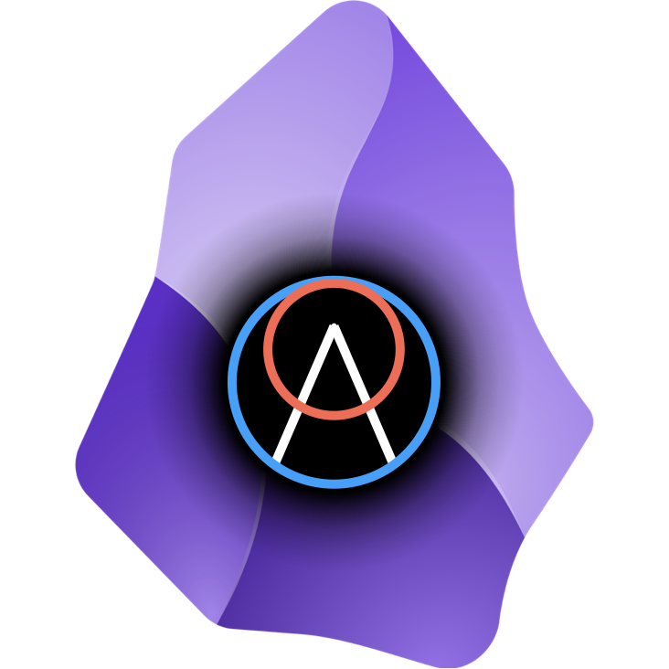

# The InterBrain: From Personal Knowledge Management to Collective Knowledge Gardening



## Introduction

The InterBrain is an innovative knowledge gardening system that aims to revolutionize the way we collectively relate to our ideas and stories. It transcends the traditional "Second Brain" paradigm, popularized by PKM tools like Obsidian, shifting to a dynamic, relational approach to organizing knowledge as opposed to static, top-down categorization.

## 🚀 Ready to Install & Try

The InterBrain is work-in-progress software with basic functionality now installable as an Obsidian plugin. You can download and install the plugin to start building your liminal web using the existing features, while other capabilities are still in development and the full vision has yet to be comprehensively implemented.

**[→ Download Plugin](https://github.com/ProjectLiminality/InterBrain/releases/tag/v0.8.0)** | **[→ Installation Guide](#installation--setup)**

## Project Status & Roadmap

> ⚡️ **Current Status: Coherence Beacon System Complete - 8 Foundation Epics Delivered**
Epic 8 (Coherence Beacon System) is complete with automatic relationship discovery, bidirectional tracking, Radicle network integration, GitHub Pages publishing, and radial action buttons. All 8 foundation epics are now complete and the InterBrain provides comprehensive distributed knowledge management.

> 🔬 **Previous Exploration:**  
Earlier exploration work including screenshots and recordings can be found at [**InterBrain-Prototype**](https://github.com/ProjectLiminality/InterBrain-Prototype). This repository contains the conceptual foundation and visual demonstrations that inform the current development approach.

> ✅ **Epic 1 Complete:**  
Foundation infrastructure with:
- Vite dual development workflow (browser + plugin)
- Command palette architecture (6 core commands)  
- Service layer abstraction (UI, Git, DreamNode, Vault)
- Zustand reactive state management
- Vitest testing framework with comprehensive coverage

> ✅ **Epic 2 Complete:**  
3D Spatial Visualization System with:
- React Three Fiber integration in Obsidian workspace
- DreamNode 3D components with star rendering
- Google Earth-style sphere rotation controls
- Fibonacci sphere layout algorithm
- Dynamic view scaling (Apple Watch style)
- Comprehensive unit test coverage

> ✅ **Epic 3 Complete:**  
DreamNode Management System with:
- Service layer architecture with mock/real implementations
- Git template system for DreamNode creation
- Visual git state indicators (red/blue/clean)
- Auto-stash creator mode workflow
- Universal drag-drop hit detection
- Proto-node creation with animations
- Robust testing infrastructure

> ✅ **Epic 4 Complete:**  
Liminal Web Layout System with:
- ✅ Spatial Orchestration System (Feature #316)
- ✅ Undo/Redo Navigation (Feature #320)
- ✅ Unified Edit Mode (Feature #321) - Complete with semantic search integration

> ✅ **Epic 5 Complete - Semantic Search System**  
Comprehensive semantic search capabilities with local AI sovereignty:
- ✅ Intelligent Indexing System (Feature #322) - Background indexing with git integration
- ✅ Ollama Embedding API Integration (Feature #290) - Local embedding generation
- ✅ Search-as-DreamNode Interface (Feature #323) - Unified search/creation UX paradigm
- ✅ Honeycomb Search Layout (Feature #280) - Mathematical precision for 1-36 node positioning
- ✅ All Epic 5 features complete with comprehensive test coverage and zero warnings

> ✅ **Constellation Layout System Complete**
Advanced force-directed relationship visualization with mathematical precision:
- ✅ Fruchterman-Reingold algorithm implementation on spherical surfaces
- ✅ Connected components clustering with automatic discovery
- ✅ Global cluster positioning via Fibonacci sphere distribution
- ✅ Exponential mapping from planar to curved space layouts
- ✅ Camera-facing orientation with 90° rotation for optimal viewing
- ✅ Interactive command integration: "Scan Vault for DreamSong Relationships" + "Apply Constellation Layout"
- ✅ Enhanced edge interaction with 12x thicker invisible hit detection
- ✅ Persistent relationship visualization across all layout modes
- ✅ [**Interactive Algorithm Demos**](https://projectliminality.github.io/InterBrain/algorithms/constellation-layout.html) with JSON data support

> ✅ **Epic 7 Complete - Conversational Copilot System**
Person-centered conversational mode with real-time capabilities:
- ✅ Real-time transcription with whisper_streaming integration
- ✅ FaceTime automation with contact metadata system
- ✅ AI-powered conversation summaries via Claude API
- ✅ Email export with Obsidian URI deep links
- ✅ Semantic search-driven UX with 500-char context window
- ✅ Fullscreen DreamTalk/DreamSong overlays
- ✅ Shared nodes tracking with bidirectional relationships

> ✅ **Epic 8 Complete - Coherence Beacon System**
Distributed knowledge management with automatic relationship discovery:
- ✅ Coherence Beacon discovery system with modal acceptance workflow
- ✅ Bidirectional relationship tracking via git hooks
- ✅ Radicle network integration with CLI automation
- ✅ GitHub Pages publishing with static DreamSong sites
- ✅ Universal DreamNode cloning (Radicle/GitHub/UUID support)
- ✅ Radial action button system with 10 context-aware buttons
- ✅ PascalCase naming system with migration tools
- ✅ Songline feature for audio perspectives
- ✅ Digital Campfire metaphor for video calls

> 🌱 **Beyond the Plugin:**
The InterBrain is designed as the foundation for **DreamOS** — a decentralized, AI-agent-powered operating system for collective sensemaking and human-computer symbiosis.

> 💡 **Development Roadmap:**
1. ✅ Electron Prototype ([InterBrain-Prototype](https://github.com/ProjectLiminality/InterBrain-Prototype))
2. ✅ Epic 1: Plugin Infrastructure (this repository)
3. ✅ Epic 2: 3D Spatial Visualization System
4. ✅ Epic 3: DreamNode Management System
5. ✅ Epic 4: Liminal Web Layout System (complete)
6. ✅ Epic 5: Semantic Search System (complete)
7. ✅ Epic 6: DreamWeaving Operations (complete)
8. ✅ Epic 7: Conversational Copilot System (complete)
9. ✅ Epic 8: Coherence Beacon System (complete)
10. 📋 Epic 9: Ready for community input and prioritization
11. 🪐 DreamOS system (future evolution)  

Current development progress is tracked through [**GitHub Issues**](https://github.com/ProjectLiminality/InterBrain/issues) and [**Project Board**](https://github.com/users/ProjectLiminality/projects/2).

## Installation & Setup

### Prerequisites

1. **Obsidian**: Download and install [Obsidian](https://obsidian.md/) if you haven't already
2. **Git**: Install [Git](https://git-scm.com/downloads) - required for DreamNode creation functionality
3. **Platform**: Developed and tested on macOS. Windows and Linux compatibility likely but not actively tested

### Plugin Installation

1. **Download**: Get the latest InterBrain plugin from [GitHub Releases](https://github.com/ProjectLiminality/InterBrain/releases)
2. **Extract**: Unzip the downloaded file to create an `interbrain` folder
3. **Install**: Drag the `interbrain` folder to your Obsidian vault's plugins directory:
   - **Location**: `<your-vault>/.obsidian/plugins/` (where `<your-vault>` is your specific Obsidian vault folder)
   - **Tip**: In Obsidian Settings → Community plugins, click the folder icon to open your plugins directory directly
4. **Enable**: Restart Obsidian, go to Settings → Community plugins, and enable "InterBrain"

### Required for Semantic Search: Ollama Setup

**Note**: Semantic search features require Ollama. Basic DreamNode creation and liminal web navigation work without it.

1. **Install Ollama**: Download from [ollama.ai](https://ollama.ai) (available for macOS, Windows, Linux)
2. **Install Model**: Run `ollama pull nomic-embed-text` in terminal
3. **Check Status**: Use command palette "Ollama: Check Status" to verify setup
4. **Index**: Run "Full Index" command to enable semantic search on your DreamNodes

### Optional: Radicle Network Setup (Peer-to-Peer Sharing)

**Note**: Radicle enables peer-to-peer DreamNode sharing without centralized servers. This is optional - DreamNodes work fully offline without it.

**Platform Support**:
- ✅ **macOS & Linux**: Full Radicle support
- ⚠️ **Windows**: GitHub-based sharing coming soon (use local-only DreamNodes for now)

**Setup Steps (macOS/Linux)**:
1. **Install Radicle**: Download from [radicle.xyz](https://radicle.xyz) and follow their installation guide
2. **Create Identity**: Run `rad auth` to set up your Radicle identity
3. **Verify**: The "Share DreamNode" command will appear in InterBrain's command palette once Radicle is detected

**Using Radicle Network**:
- **Initialize**: After creating a DreamNode, open Terminal in that directory and run `rad init --name "YourNodeName"`
- **Share DreamNode**: After making commits (saves), use "Share DreamNode" to push to the Radicle network
- **Clone DreamNode**: Use "Clone DreamNode from Radicle Network" and enter a friend's Radicle ID
- **Note**: Automatic initialization during DreamNode creation is not yet supported due to Radicle CLI requirements

**What is Radicle?**: A peer-to-peer alternative to GitHub that enables decentralized code collaboration. Your DreamNodes sync directly with trusted peers instead of through centralized servers. Perfect for private knowledge sharing within friend/family networks.

---

## Radicle Architecture: Pure Peer-to-Peer Dreamweaving

InterBrain is fundamentally a **specialized GUI client for Radicle**, implementing a constrained, extremely peer-to-peer subset of Radicle's capabilities optimized for trust-based knowledge sharing.

### Core Design Principle: Radicle as Single Source of Truth

**The Collapse**: Instead of maintaining parallel relationship graphs (UUID-based `.udd` files + Radicle network state), we collapse to a single source of truth: **Radicle IS the Liminal Web**.

**Identity System**:
- **Dream Nodes**: Identified by Radicle Repository ID (`rad:z2u...`)
- **Dreamer Nodes**: Identified by Radicle DID (`did:key:z6Mks...`)
- **Type Inference**: Format determines type (no mutable `type` field needed)
- **No UUIDs**: Radicle identifiers replace all UUID-based tracking

**Minimal `.udd` Schema**:
```json
{
  "id": "rad:z2u2AB..." or "did:key:z6Mks...",
  "title": "Square",
  "dreamTalk": "Square.png",
  "submodules": [],
  "supermodules": []
}
```

### The Three Constraints: Pure P2P Configuration

Every InterBrain DreamNode is configured with these mandatory Radicle settings:

1. **Equal Delegates** (`--threshold 1`):
   - Every peer is equally authoritative
   - Any delegate can push changes
   - No hierarchy, pure peer-to-peer
   - Command: `rad id update --delegate <DID> --threshold 1`

2. **Followed Scope** (`--scope followed`):
   - Only fetch from peers you explicitly trust
   - Changes flow through social relationships
   - No stranger contributions
   - Command: `rad seed <RID> --scope followed`

3. **Bidirectional Trust**:
   - When Alice shares with Bob, both follow each other
   - Mutual delegation (both can push)
   - Symmetric collaboration by default
   - Commands: `rad follow <DID>` (both directions)

### Two-Layer Architecture: Global Trust + Organic Collaboration

**Layer 1: Global Following** (Radicle node config):
```bash
rad follow did:key:z6MksBob... --alias Bob
rad follow did:key:z6MksCharlie... --alias Charlie
```
- Who you trust across ALL projects
- Visible via: `rad follow --list`
- Maps to: Dreamer nodes in DreamSpace (ring around InterBrain)

**Layer 2: Per-Repo Delegation** (repo metadata):
```bash
rad id update --delegate did:key:z6MksBob... --threshold 1
```
- Who holds THIS specific DreamNode (can push)
- Visible via: `rad id show <RID>`
- **Share = Delegate** (one action, not separate concepts)

**Liminal Web Edges = Pure Intersection:**
```typescript
// Collaboration edges emerge automatically from Radicle state
const followed = await rad.getFollowedPeers();      // Global trust
const delegates = await rad.getDelegates(dreamNodeRID); // Who holds this idea

// Edges appear/disappear automatically
const collaborators = followed.filter(p => delegates.includes(p.did));
```

**Zero custom state needed** - UI reflects Radicle reality directly.

### Data Flow: One-Directional (Radicle → UI)

**Core Principle**: Radicle does what it does. InterBrain UI adapts to Radicle, never interferes.

**Radicle → InterBrain** (read only):
- `rad follow --list` → Populate Dreamer nodes in DreamSpace
- `rad id show <RID>` → Discover who holds this DreamNode
- Intersection → Collaboration edges appear automatically in Liminal Web
- `rad sync` + `git fetch <peer>` → Get updates from all followed delegates

**InterBrain Performance Cache** (ephemeral, not source of truth):
```typescript
// Cache Radicle queries for UI performance only
interface CachedRadicleState {
  followedPeers: Map<DID, DreamerMetadata>;     // from rad follow --list
  delegatesByRepo: Map<RID, DID[]>;             // from rad id show
  lastSyncTime: timestamp;
}
// Refresh periodically or on user action
// Always treat Radicle CLI output as authoritative
```

**User Actions That Modify Radicle** (via standard rad/git commands):
- Share DreamNode → `rad clone` + `rad follow` + `rad id update --delegate`
- Accept update → `git merge <peer>/main` + `git push rad main`
- Follow peer → `rad follow <DID>`

**Emergent Behavior Example**:
1. Alice follows Bob, Charlie, Diana (global trust)
2. Alice shares Square with Bob → Bob becomes delegate
3. Bob shares Square with Charlie → Charlie becomes delegate
4. **Automatically**: Alice sees Square edge to Charlie in UI (she follows Charlie, Charlie is delegate)
5. Diana is NOT delegate → No edge appears (even though Alice follows her)

### Transitive Trust: Social Resonance Filter

**Scenario**: Alice ↔ Bob ↔ Charlie (Alice doesn't follow Charlie)

**How Changes Flow**:
1. Charlie edits Square → `git push rad main`
2. Bob fetches Charlie → `git fetch charlie`
3. Bob reviews and merges → `git merge charlie/main`
4. Bob pushes merged state → `git push rad main`
5. Alice fetches Bob → `git fetch bob` (includes Charlie's work transitively)
6. Alice merges Bob → Gets Charlie's ideas through Bob's curation

**Key Insight**: Alice receives Charlie's contributions WITHOUT directly following Charlie. Bob acts as curator/bridge. Changes propagate through trust relationships, not broadcast.

### Intentional Divergence: Curation as Feature

**Rejection is Silent**:
- Alice fetches Bob's changes: `git fetch bob`
- Alice reviews: `git log HEAD..bob/main` (sees Bob added `controversial.pdf`)
- Alice decides: "Not merging this" (no `git merge` command)
- Result: Alice's fork doesn't include the file
- Consequence: Alice's peers won't see it (transitive filtering)

**Perspectives Coexist**:
- Bob's fork: Has controversial.pdf ✅
- Alice's fork: Doesn't have it ❌
- Different truths coexist, filtered by social curation
- No global consensus needed

### Merge Conflicts: Rare and Manageable

**Dreamweaving Conflict Reality**:
- 🟢 **90%+ auto-merge**: Different files or different sections
- 🟡 **5% trivial**: Canvas JSON (keep both nodes via union)
- 🔴 **5% real**: Same text rewritten (requires human judgment)

**Conflict Resolution Strategy**:
1. **Preview First**: Show diff before merging (`git diff <peer>/main`)
2. **Auto-Merge Safe Cases**: Different files, different sections
3. **Canvas-Aware Merging**: Union of nodes/edges (structural merge)
4. **LLM Assistance**: Future feature for synthesizing conflicting edits
5. **User Approval**: Always human-in-loop for ambiguous cases

**Git Remembers**: Merge commits establish "integrated up to this point." Same conflict never re-appears.

### Scalability: O(1) Complexity Per Person

**The Induction Proof**:
- **Base case**: Alice ↔ Bob (2 people) = O(1) fetches each ✅
- **Inductive step**: Add Charlie → Each person still O(1) fetches ✅
- **Result**: Scales from 3 to 3 million people

**Why It Scales**:
- **Local Coherence**: Each person manages ~5-10 direct peers
- **Transitive Integration**: Bob curates Charlie + Diana → Alice merges Bob once
- **Git DAG**: Distributed by design (Linux kernel: 1000+ contributors, decades)
- **No Global Consensus**: Different perspectives coexist peacefully

**What Would Break Scalability**:
- ❌ `--scope all` (fetch from everyone) → O(N) complexity
- ❌ No curation (merge all peers directly) → O(N) operations
- ❌ Single shared canvas (1000 people editing) → Frequent conflicts

**InterBrain Avoids All Anti-Patterns** ✅

### Implementation Patterns

**DreamNode Creation** (Alice):
```bash
rad init --name "Square" --default-branch main
git add . && git commit -m "Initial commit"
git push rad main
rad seed <RID> --scope followed
```

**Sharing via Obsidian URI** (Alice → Bob):
```
obsidian://interbrain-share?
  rid=rad:z2u2ABsquare...&
  did=did:key:z6MksAlice...&
  name=Alice&
  title=Square
```

**Receiving Share** (Bob, automatic):
```bash
rad clone <RID>                                  # Clone repo
rad follow <Alice-DID> --alias Alice             # Global trust
rad id update --delegate <Alice-DID> --threshold 1  # Alice can push
rad seed <RID> --scope followed                  # Only followed peers
git remote add alice rad://<RID>/<Alice-DID>    # Track Alice's fork
# Create Alice Dreamer node in vault
```

**Check for Updates** (Bob from Alice):
```bash
rad sync                      # Fetch from seed nodes (all followed delegates)
git fetch alice               # Get Alice's specific fork
git log HEAD..alice/main      # Preview new commits
git merge alice/main          # Accept changes (user approval)
git push rad main             # Share merged state
```

**Discover Collaborators** (pure Radicle query):
```typescript
// Who collaborates on Square? (intersection query)
async function getCollaboratorsForDreamNode(dreamNodeRID: string) {
  const followed = await rad.getFollowedPeers();      // Global trust
  const delegates = await rad.getDelegates(dreamNodeRID); // Who holds Square

  // Collaboration edges = intersection (automatic)
  return followed.filter(peer => delegates.includes(peer.did));
  // These edges appear in Liminal Web UI automatically
}
```

### Key Architectural Insights

1. **Identity Collapse**: rad:* + did:key:* replaces UUIDs entirely
2. **Single Source of Truth**: Radicle IS the Liminal Web (no parallel graphs)
3. **One-Directional Flow**: Radicle → UI (InterBrain adapts, never interferes)
4. **Share = Delegate**: One action creates collaboration (not separate concepts)
5. **Organic Emergence**: Edges appear automatically from `followed ∩ delegates`
6. **Transitive Curation**: Changes flow through social graph, not broadcast
7. **Intentional Divergence**: Forks coexist, consensus unnecessary
8. **O(1) Scalability**: Local coherence scales globally
9. **Git Native**: All merge/conflict resolution via standard git
10. **Performance Cache Only**: InterBrain caches queries but Radicle CLI is authoritative

**InterBrain = Radicle GUI client for trust-based knowledge gardening** 🌱

**Design Philosophy**: Trust Radicle's architecture. Build a beautiful window into the peer-to-peer network, not a replacement for it.

---

### Getting Started

Once installed, try this simple exercise to build your first liminal web:

1. Open Obsidian and activate the InterBrain workspace via command palette
2. **Run "Full Index"** command (required for semantic search functionality)
3. Create a DreamNode for any project or idea you're working on
4. Click that node to enter liminal web mode (focused layout)
5. **Run "Enter Edit Mode"** command to edit nodes and relationships in 3D space
6. Drag and drop pictures of collaborators (name files with their names)
7. Click on any person to focus on them, then add shared projects/ideas
8. Watch your personal knowledge network emerge through relationships

**Essential Commands:**
- **"Ollama: Check Status"**: Verify if Ollama is properly set up for semantic search
- **"Full Index"**: Index your DreamNodes for semantic search (required after Ollama setup)
- **"Enter Edit Mode"**: Edit node content and relationships while in liminal web view
- **"Activate Search Interface"**: Use semantic search to find and create nodes (requires Ollama + indexing)

### Important Notes

**Security & Development Status**: InterBrain is work-in-progress software under active development. All code is built transparently in public on GitHub where you can review the complete source code and development history. Users should exercise their own judgment when installing development software. As we approach a stable release, security, stability, and comprehensive testing will receive focused attention in line with production software standards.

## Core Concepts

### Dream Nodes

The fundamental unit of Project Liminality is the "Dream Node," which is implemented as a Git repository. Dream Nodes can embody two primary concepts:

1. **Dreams**: Abstract ideas, concepts, or any form of knowledge.
2. **Dreamers**: Representations of people or peers.


This dual nature allows for a flexible and interconnected knowledge structure.

### Dream Talk and Dream Song

Each Dream Node consists of two main components:

- **Dream Talk**: A concise, symbolic representation of the idea (like a thumbnail).
- **Dream Song**: A more elaborate explanation or exploration of the idea, containing multiple references to other Dream Talks.


### The InteBrain

Project Liminality structures knowledge based on social relationships and interactions, creating an "InteBrain." This approach allows users to organize information along the lines of their actual relational fields, transcending static, top-down categorization.
Thus uniting the multiplicity of Second Brains into a singular, interconnected InterBrain structure.


## Key Features

### 🌱 DreamNode Creation

Creating a new DreamNode is as easy as dragging and dropping a visual representation (DreamTalk) onto the interface. This will automatically create a new DreamNode with the same name as the file, containing the file.
Using the Command-N keyboard shortcut you can also create an empty DreamNode with your name of choice.


### 🕸️ Liminal Web

By linking the ideas you hold to the people you share them with, DreamNodes self-organize into your unique "Liminal Web."


This allows you to navigate your knowledge in an intuitive and organic fashion, transcending the need for contrived categorization or hierarchical management.


### 🔍 Semantic Search

Finding relevant DreamNodes is made easy and intuitive through semantic search - no need to worry about typos or remembering the exact name of any given idea!
Just enter a search query that is close enough in meaning to what you're looking for and it will magically be revealed.
(This existing feature is the basis for a yet-to-be-implemented realtime conversational copilot that always has the most relevant knowledge at hand for sharing during free-flowing conversation.)


### 🧬 DreamWeaving

Just like individual software modules can be combined into more sophisticated projects using git repositories, DreamNodes can be woven together into larger wholes. Using the Obsidian canvas, DreamTalk symbols can be woven together with text into DreamSongs. The resulting DreamSong can in turn again be distilled into a single DreamTalk symbol. This reciprocal and recursive many-to-one mapping between DreamSong and DreamTalk allows for the emergence of a vertical holarchy of DreamNodes. A universal pattern for performing the Hegelean Dialectic of ideas in the digital!


### 🔆 Coherence Beacon

Every time any Dreamer weaves together DreamNodes into larger wholes, the Coherence Beacon is triggered. This mechanism automatically identifies the subset of peers with whom they share any of the input DreamNodes and offers them the higher order DreamNode (including all input DreamNodes they may or may not already hold). By accepting the invitation they extend the signal to all of their peers and so on. This way only coherent ideas spread based on how much they resonate with the network, solving the virality problem. 
Freedom of speech bound by meritocratic reach!


### 🤖 Integrated AI Assistant

Since DreamNodes are based on git repositories, prominent AI pair-programming solutions like aider or cursor, being optimized for git, integrate seamlessly with the system. And just like the InteBrain generalizes git repos from computer code to all of knowledge, the same can be done out of the box with AI pair-programmers, using them as universal magical co-creators!
With ever more powerful, local, multi-modal models on the horizon and deeper integrations through frameworks like Model Context Protocol (MCP) truly the sky is the limit in terms of what can be achieved collectively through the InteBrain!


### 💬 Conversational Co-Pilot (TBD)

Through realtime transcription of free flowing conversations (video call or in-person) combined with the existing semantic search functionality, the system will constantly filter for the most relevant DreamNodes, making them readily available for reference and sharing during the dialogue - all without interrupting the flow! Say goodbye to awkward interruptions due to not finding a reference!
And the best part: referencing a DreamNode (implicitly or explicitly) automatically offers your peer to clone it. Which means sharing an idea and collaborating on it is the same thing in this system.


### 🎵 Songlines (TBD)

Everytime an idea is shared during a conversation, and thus the corresponding DreamNode is cloned, the relevant clip of the conversation is automatically added to the DreamNode as yet another way of expressing the idea. This way every DreamNode remembers the path it travels in a unique set of conversation clips - its Songline!
Not only do Songlines allow for an organic, decentralized and emergent replacement for static textbook definitions, they also constitute an invaluable source of community-generated and -owned data for representing knowledge in the most effortless yet high bandwidth way. In anticipation of local, multi-modal LLMs with effectively infinite context windows these Songlines may turn out to be a game changer in terms of leveraging collective knowledge and wisdom into actionable projects.


### 📱 Git Client Integration

Easily open any given DreamNode in your favorite git client of your choice.


### 📊 Organic Content Visualization

The content within a DreamNode is visually accessible on the backside using the beautiful circle packing algorithm of D3. Instantly access files and folders directly from the InteBrain.


### 📂 Finder Integration

Reveal DreamNodes in your file system with just one click.


## Real-World Applications & Project Synergy

The InteBrain system transforms how we share and organize knowledge, creating an organic ecosystem where ideas and initiatives can flourish together.

### 🎙️ Enhanced Podcasting
- **Real-time knowledge access**: Conversational copilots filter relevant dream nodes based on discussion topics
- **Enriched show notes**: Share actual knowledge units rather than just superficial references
- **Depth in knowledge transfer**: Audience receives not just references but entire repositories of contextual information

### 🔎 Collaborative Investigation
- **Emergent collective intelligence**: Investigators can effortlessly combine evidence and knowledge
- **Coherence Beacon in action**: Automatically invites collaborators who hold relevant knowledge
- **Scaling potential**: Enables millions of citizen journalists to work together on complex cases

### 🎓 Future of Education
- **Dissolving artificial boundaries**: Between disciplines and between education and life itself
- **Living classroom**: Every conversation becomes an educational opportunity
- **Emergent curriculum**: Knowledge expands organically based on contextual relevance
- **Symbolic teaching**: Complex ideas transmitted through symbols backed by detailed dream nodes

### 🎨 Co-Creation Renaissance
- **Source and product travel together**: Creative works remain connected to their source files
- **Open source everything**: Any digital creation becomes remixable and extensible
- **Infinite collaboration**: Weave different creations together through dream weaving
- **Context creation**: Shift from "content creators" to "context creators" with living, evolving works

### 🕊️ End of Narrative Warfare
- **Signal amplification**: Filter out noise in competing narratives
- **Perspective integration**: Combine viewpoints to approach deeper truth
- **Social resonance filter**: Collective intuition helps identify coherent syntheses
- **Propaganda immunity**: System design makes manipulation difficult while healing divisive narratives

### 🌐 Emergent Collaborative Networks
- **Dream nodes for all initiatives**: Any project can be represented as a dream node while maintaining independence
- **Cross-pollination**: Knowledge flows freely between initiatives while respecting autonomy
- **Resonance-based connections**: Projects naturally find their complementary partners
- **No central authority**: Collaboration emerges organically based on relevance and resonance

### 🌿 Conscious Communities
- **Knowledge transfer across communities**: Solutions developed in one place effortlessly reach others
- **Contextual distribution**: Learning finds exactly where it's needed based on relevance
- **Social relationship propagation**: Knowledge travels through trusted connections
- **Emergent collective problem-solving**: Communities evolve together rather than in isolation

### 🚀 From Incubation to Implementation
- **Project merging and spawning**: Smaller initiatives can unify or new ones can form from combinations
- **Solutions combine into higher-order solutions**: Building blocks of knowledge stack meaningfully
- **Universal pattern recognition**: Similar challenges across different domains find common solutions
- **Network of conversations**: All collaboration is rooted in human connection and meaning

## Frequently Asked Questions

### How does InterBrain prevent echo chambers while maintaining coherence filtering?

InterBrain addresses the echo chamber problem through a unique **holographic approach** that emphasizes connection over separation. Unlike traditional social media that amplifies differences and enables ideological bubbles, InterBrain's design makes separation literally invisible while highlighting what connects people.

**The Holographic Principle**: Stories contain people, and people hold stories - they contain each other in a holographic structure where each part contains the whole. This means you can "zoom in" from any relationship to discover the entire network of connections.

**How It Works**:
- **Focus on Connection**: The system only shows you what you share with others, never what separates you
- **Filter Bubble Dissolution**: When someone shares a monolithic idea (like "communism"), the system automatically breaks it into constituent sub-modules, creating multiple touchpoints for connection beyond the ideology
- **Contextual Perspective**: Ideas exist alongside grandma's recipes and childhood comics, naturally right-sizing ideological concepts
- **Dream Weaving**: You can "unweave" large concepts into smaller components, then re-weave them with different elements, creating bridges between seemingly opposed viewpoints

**The Result**: Instead of filter bubbles, you get an interconnected mycelium network where people constantly discover new relationships and deeper connections. Ideologies become "just one more thought form" among many, losing their disproportionate influence on human relationships.

**Social Resonance**: The Coherence Beacon system ensures that only genuinely coherent ideas spread, based on authentic resonance rather than viral manipulation. The network effect becomes heart-based rather than algorithm-driven.

### What makes InterBrain different from existing knowledge management tools?

**Relational vs. Hierarchical**: Unlike traditional PKM tools that organize information in static categories, InterBrain organizes knowledge along the lines of your actual social relationships and interactions.

**Git-Native Architecture**: Every piece of knowledge is a git repository, enabling true version control, collaboration, and decentralized distribution of ideas.

**3D Spatial Interface**: Ideas exist in a 3D cosmos that reflects their relationships, moving beyond flat file structures to intuitive spatial navigation.

**Social Propagation**: Knowledge spreads through authentic social connections rather than algorithmic recommendation, creating trust-based rather than engagement-based distribution.

### Why use git repositories for individual ideas?

**Version Control for Thoughts**: Ideas evolve over time - git tracks this evolution naturally while preserving the complete history of how your thinking developed.

**True Collaboration**: Multiple people can contribute to the same idea while maintaining clear attribution and merge capabilities.

**Decentralized Architecture**: No central server dependency - your knowledge remains yours while being shareable with your network.

**AI Integration**: Git-optimized AI tools (like Aider) work seamlessly with DreamNodes, turning AI assistants into universal co-creators for any type of knowledge.

**Future-Proofing**: As the system evolves toward DreamOS, the git foundation enables unprecedented composability between different applications and knowledge domains.

## Command Architecture

The InterBrain plugin uses Obsidian's command palette as the primary abstraction layer between UI interactions and backend operations. All functionality is accessible via keyboard shortcuts (Cmd/Ctrl+P) and can be triggered programmatically.

### Available Commands

All commands are prefixed with `InterBrain:` in the command palette:

- **Open DreamSpace** - Opens the 3D spatial visualization view
- **Save DreamNode (commit changes)** - Commits current changes with AI assistance
- **Create new DreamNode** - Creates a new Dream or Dreamer node
- **Weave Dreams into higher-order node** - Combines selected nodes via git submodules
- **Toggle DreamNode selection** - Select/deselect nodes for bulk operations
- **Share DreamNode via Coherence Beacon** - Share nodes through the social resonance network

### Service Layer Architecture

The plugin implements a clean separation of concerns through dedicated services:

- **UIService** - User notifications and feedback (success, error, loading states)
- **GitService** - Git operations abstraction (commit, create, weave)
- **DreamNodeService** - DreamNode state management and selection
- **VaultService** - Obsidian Vault API wrapper for file operations

### Programmatic Access

UI components can trigger commands programmatically:

```typescript
this.app.commands.executeCommandById('interbrain:save-dreamnode');
```

This architecture ensures all functionality remains accessible to both power users (via command palette) and regular users (via UI buttons), while maintaining a clean separation between presentation and business logic.

### State Management with Zustand

The plugin uses Zustand for centralized, reactive state management that integrates seamlessly with the command-driven architecture.

#### Store Structure

```typescript
interface InterBrainState {
  selectedNode: DreamNode | null;        // Currently selected node
  searchResults: DreamNode[];            // Search/filter results
  spatialLayout: 'constellation' | 'search' | 'focused'; // 3D layout mode
}
```

#### Integration Pattern

**Commands → Services → Zustand State → UI Reactivity**

```typescript
// 1. Command executes
this.addCommand({
  id: 'save-dreamnode',
  callback: async () => {
    const currentNode = this.dreamNodeService.getCurrentNode(); // 2. Service provides state
    // ... business logic
  }
});

// 3. Service updates both internal and reactive state
setCurrentNode(node: DreamNode | null): void {
  this.currentNode = node; // Internal state
  useInterBrainStore.getState().setSelectedNode(node); // Reactive state
}

// 4. Future UI components read reactively
const selectedNode = useInterBrainStore(state => state.selectedNode);
```

#### Testing Commands

The plugin includes test commands to verify state synchronization:
- `[TEST] Select Mock DreamNode` - Creates a test node and updates state
- `[TEST] Clear DreamNode Selection` - Clears selection and updates state

These demonstrate the complete flow from command execution to state updates that future UI components can react to.

### Testing Framework

The plugin uses Vitest for comprehensive testing with co-located test patterns following our vertical slice architecture.

#### Test Organization

Tests are co-located with the code they test:
```
src/
├── services/
│   ├── dreamnode-service.ts
│   ├── dreamnode-service.test.ts    # Co-located tests
│   └── ui-service.test.ts
├── store/
│   ├── interbrain-store.ts
│   └── interbrain-store.test.ts
└── features/                        # Future vertical slices
    └── dream-weaving/
        ├── DreamWeaving.tsx
        └── DreamWeaving.test.tsx
```

#### Test Categories

**Unit Tests**: Service methods, store actions, pure functions
**Integration Tests**: Command → Service → State flow
**Component Tests**: React components with user interactions (future)

#### Running Tests

```bash
npm run test          # Run all tests
npm run test:watch    # Watch mode for development  
npm run test:coverage # Generate coverage reports
npm run check-all     # Lint + typecheck + test
```

#### Test Utilities

**Mock Factories**:
```typescript
const mockNode = createMockDreamNode({ name: 'Custom Name' })
const mockService = createMockUIService()
```

**Store Testing**:
```typescript
// Store tests verify reactive state management
expect(useInterBrainStore.getState().selectedNode).toBe(mockNode)
```

**Obsidian Mocking**: All Obsidian APIs are mocked for isolated testing without dependencies on the Obsidian environment.

## License

Project Liminality is released under the [GNU AFFERO GENERAL PUBLIC LICENSE](LICENSE).

## Acknowledgements

Much of the philosophical foundation for this project has been created in conversation with my co-visionary and dear friend Anna Ziegler. Check out her one-of-a-kind work at https://goodfairy.gift
